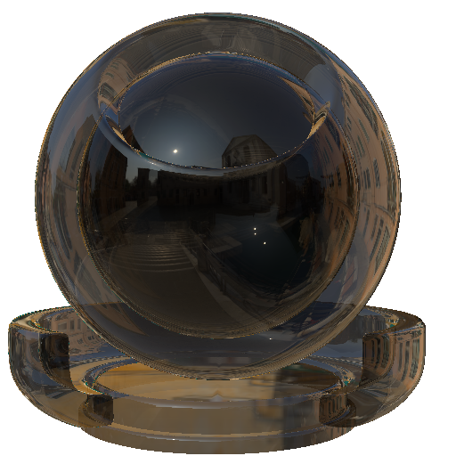
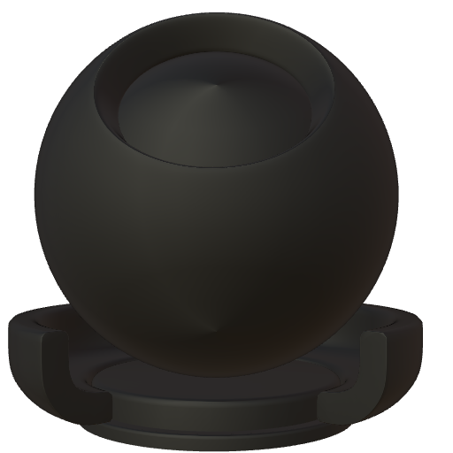

## Physically Based Materials USD Tests

This folder uses the MaterialX definitions extracted from the `PhysicallyBased` material database.

The materials can be downloaded via the web interface can found on this [site](https://kwokcb.github.io/MaterialXLab/javascript/PhysicallyBasedMaterialX_out.html), or the via the `Python` package [materialxMaterials](https://pypi.org/project/materialxMaterials/) may be
used. Note that the package can also be used to download other materials from other MaterialX libraries.

The MaterialX materials can be converted to Usd equivalents and optionally rendered using the `run_pb` script found in the `tests` folder.

Current this will execture:

```sh
python ../source/materialxusd/mtlx2usd.py -pp -v -sf -mn $* -m ./physically_based
```

If `-r` is specified then this get's picked as as an argument (`$*`) and will render the Usd materials using `usdrecord`. The results can be found
in the `stdsurf_materials` subfolder and are published [here](https://kwokcb.github.io/materialxusd//tests/usd_physically_based_gallery.html)

Some examples:
| Material | USD Material Render |
| :--: | :--: |
| Brass |  |
| Honey |  |
| Black Musuo |  |

